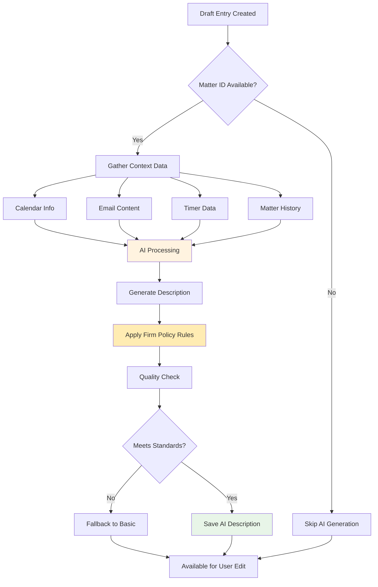
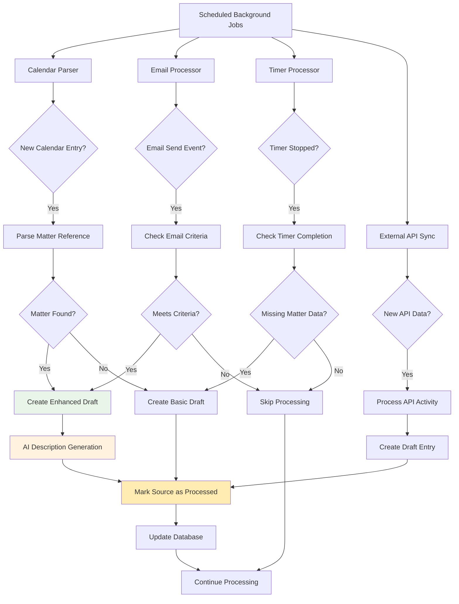
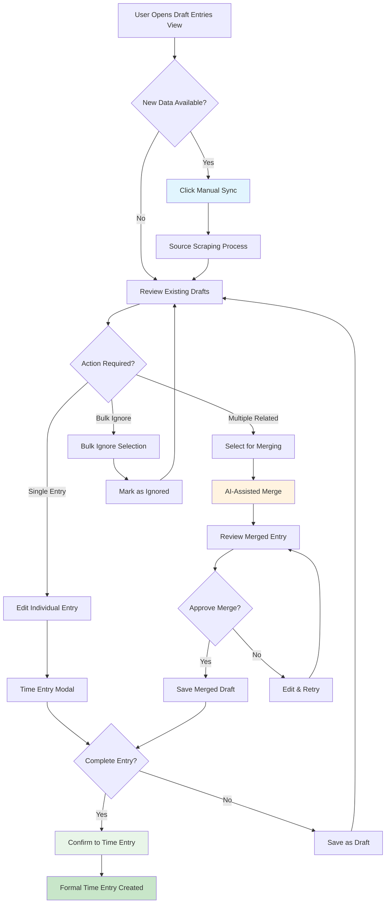
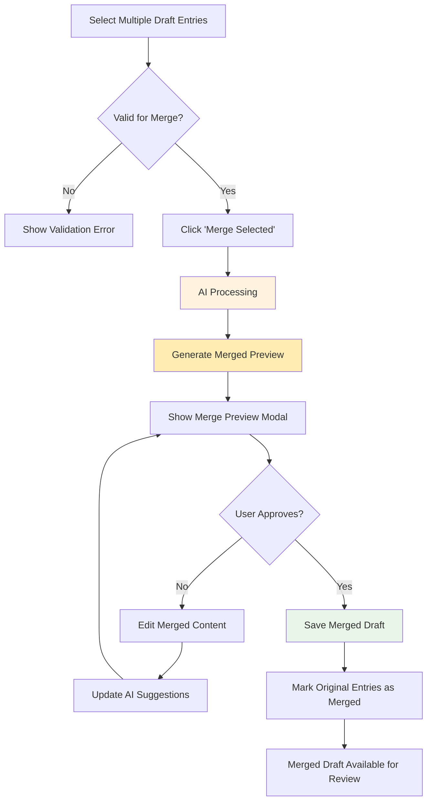
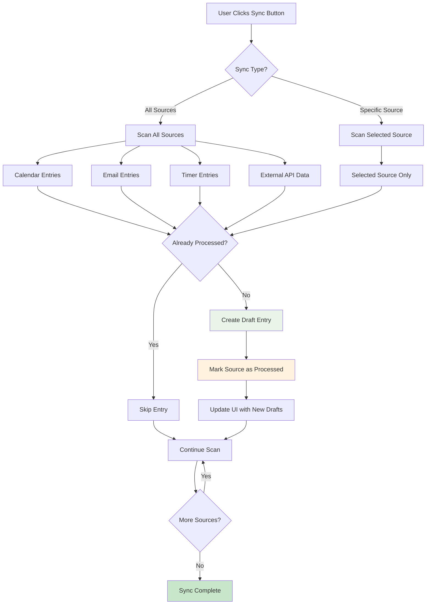
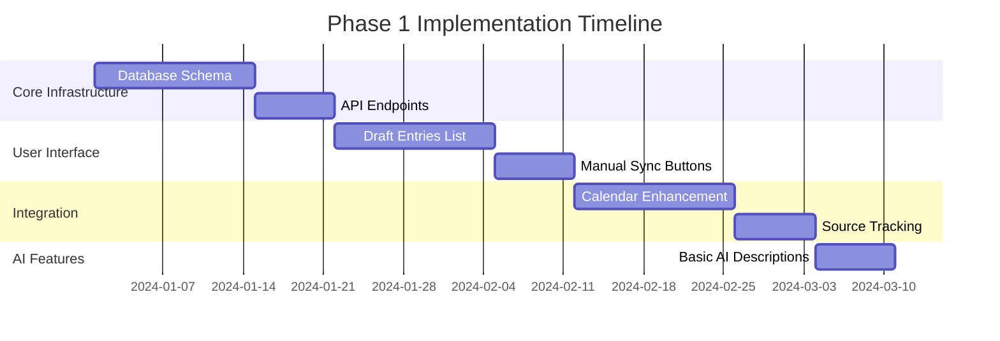

# ALP Time Entry Automation - Product Requirements Document

## 📋 **Document Information**
- **Version**: 1.0
- **Date**: August 2025
- **Owner**: Product Team
- **Status**: Draft

---

## 🎯 **Product Overview**

### **Vision Statement**
Reduce manual time entry overhead by automating the capture and preprocessing of time data from passive sources, enabling fee earners to focus on billable work rather than administrative time tracking.

### **Problem Statement**
Currently, fee earners must manually create time entries for all work performed, leading to:
- **Lost billable time** due to forgotten or delayed time entry
- **Administrative overhead** interrupting productive work
- **Inconsistent time recording** across different work types
- **Delayed invoicing** due to incomplete time capture

### **Solution Overview**
Implement a **Draft Time Entries** system that automatically captures potential billable time from passive sources (calendar entries, emails, timers) and presents them in a centralized interface for quick review and conversion to formal time entries.

---

## 🚀 **Business Objectives**

### **Primary Goals**
1. **Increase Time Capture Rate**: Reduce unbilled time due to forgotten entries
2. **Reduce Administrative Burden**: Minimize time spent on time entry administration
3. **Improve Time Entry Quality**: Leverage AI for consistent, policy-compliant descriptions
4. **Accelerate Billing Cycles**: Faster conversion from work to invoicing

### **Success Metrics**
- **Adoption Rate**: % of fee earners actively using draft time entry features
- **Time Capture Improvement**: Increase in average daily billable hours recorded
- **Efficiency Gain**: Reduction in time spent on time entry administration
- **Data Quality**: Improvement in time entry description consistency

---

## 👤 **User Personas & Use Cases**

### **Primary Users**
- **Fee Earners**: Lawyers and legal professionals who bill time
- **Administrative Staff**: Support staff managing time entry data
- **Partners**: Senior staff monitoring billable hour performance

### **Key User Stories**

#### **As a Fee Earner:**
- "I want my calendar meetings with matter references to automatically become draft time entries"
- "I want to quickly review and approve multiple draft entries in one place"
- "I want AI to suggest descriptions that match our firm's time entry policies"
- "I want to bulk process similar entries to save time"

#### **As Administrative Staff:**
- "I want to monitor draft entries across all fee earners"
- "I want to ensure no billable time is missed due to oversight"
- "I want consistent time entry quality across the firm"

---

## 🛠 **Functional Requirements**

### **Phase 1: Calendar Integration & Draft Interface**

#### **1.1 Enhanced Calendar Time Entry**
- **Requirement**: Automatic matter detection from calendar entries
- **Current State**: Manual matter selection after clicking "Record my time"
- **New Behavior**: 
  - Parse calendar subject for matter references in format `[12345]`
  - Pre-populate matter, outcome, and component in time entry modal
  - Maintain existing manual override capability

#### **1.2 Draft Time Entries List View**
- **Core Interface**: Central dashboard for managing draft time entries
- **Display Fields**:
  - Date/Time of work
  - Source (Calendar, Email, Timer, API)
  - Duration
  - Potential matter (if detected)
  - Description preview (truncated)
  - Status indicator
  - Merge indicator (if entry is combination of multiple sources)
- **Global Actions**:
  - **Manual Sync**: Trigger immediate scraping of all sources (Calendar, Email, Timer, RescueTime)
  - **Source-Specific Sync**: Individual buttons for each source type
- **Actions Per Entry**:
  - **Edit**: Open detailed time entry modal. The user can complete the missing elements of the time entry. Once all elements have been entered, the time entry can be finalised. Until that time, the time entry needs to remain in draft. 
  - **Ignore**: Mark as ignored (permanent, prevents re-appearance)
  - **Confirm**: Convert to formal time entry (only if all time entry elements are complete - then the button appears)

#### **1.3 Bulk Operations**
- **Bulk Ignore**: Select multiple entries to ignore simultaneously
- **Bulk Merge**: Combine (Merge) multiple related entries into single time entry with AI-assisted description
- **Filter/Sort**: By date, source, matter, status, merge status

#### **1.4 Draft Entry State Management**
- **Draft Status**: Incomplete entries saved for later completion
- **Ignored Status**: Permanently dismissed entries (retained in database)
- **Complete Status**: All required fields populated, ready for confirmation
- **Confirmed Status**: Converted to formal time entry

Required fields for confirmation:
- Date/time of work
- Duration (minutes)
- Matter ID, being 5 digits in square brackets eg. [12345]
- Description (policy-compliant)
- Optional but recommended: outcome and/or component

#### **1.5 Admin Page**
- Purpose: Centralize configuration for automated capture
- Source selection: Toggle on/off per source (Calendar, Email, Timer, External APIs)
- Email criteria (examples, all optional):
  - Only emails with attachments
  - Minimum body length (characters)
  - Subject qualifier (e.g., leading token like "T")
  - Require bracketed matter reference in subject or body
- Calendar criteria: Include/exclude private events; minimum duration; require bracketed matter reference
- External API configuration: API keys, scopes, polling windows
- Storage: Persist per-user and/or firm-default settings
- Security: Only admins can change firm defaults; users can override personal settings


### **Phase 2: Email Integration**
- **Source**: Microsoft Graph API email data (already stored in ALP database)
- **Trigger Criteria**: 
  - Sent emails containing matter references `[12345]` or `[T12345]` and meeting criteria set in Admin Page (e.g., attachments only, minimum content length, subject qualifier)
- **Draft Creation**: Automatic draft entry generation upon email send

### **Phase 3: Timer Integration**
- **Source**: Existing timer entries without assigned matter/component
- **Trigger**: Timer stop event when matter not assigned
- **Draft Creation**: Convert incomplete timer to draft entry

### **Phase 4: External API Integration**
- **Priority**: RescueTime API (other APIs TBD)
- **Data Mapping**: Map external time tracking to potential billable activities
- **Draft Creation**: Generate drafts from qualified external time data

---

## 🤖 **AI Enhancement Features**

### **AI Description Generation**



**AI Enhancement Details:**
- **Trigger**: Available when matter ID is detected in draft entry
- **Input Context**: 
  - Calendar information (attendees, subject, description, action items)
  - Email content and metadata
  - Timer session data
  - External API activity data
  - Matter context and history
- **Output**: Policy-compliant time entry descriptions
- **Quality Standards**: Adherence to firm's time entry wording policy
- **User Control**: AI suggestions editable/overridable in time entry modal

### **AI-Powered Entry Merging**
- **Trigger**: When multiple draft entries are selected for bulk merge
- **Merge Logic**:
  - **Time Aggregation**: Sum durations from all selected entries
  - **Date Consolidation**: Use earliest start time as entry date
  - **Source Combination**: Preserve all source references in metadata
  - **Description Synthesis**: AI combines all descriptions and metadata into coherent narrative
- **AI Context for Merging**:
  - All source descriptions and metadata
  - Overlapping time periods and participants
  - Matter context and typical work patterns
  - User's historical time entry language patterns
- **User Review**: Merged entries always require user review before confirmation

### **Smart Component/Outcome Suggestion**
- **Criteria**: High confidence matches only
- **Fallback**: Default to description-only if uncertainty exists
- **Learning**: Improve suggestions based on user corrections

---

## ⚙️ **Technical Requirements**

### **Database Schema Extensions**

#### **Draft Time Entries Table**
```sql
draft_time_entries (
    id,
    user_id,
    source_type,  -- 'Calendar', 'Email', 'Timer', 'API'
    source_id,    -- Reference to calendar_entries, emails, timers, etc.
    date,
    duration_minutes,
    description,
    matter_id,    -- Detected or manually assigned
    matter_component_id,  -- Optional
    matter_outcome_id,    -- Optional
    status,       -- 'draft', 'ignored', 'complete', 'confirmed'
    ai_generated_description,
    original_context,  -- JSON blob with source data
    is_merged_entry,   -- Boolean: true if this entry combines multiple sources
    merged_source_ids, -- JSON array of source IDs that were combined
    merged_source_metadata, -- JSON blob preserving all original source data
    created_at,
    updated_at,
    processed_at,
    is_deleted
)
```

Recommended indexes:
```sql
CREATE INDEX idx_dte_user_status_date ON draft_time_entries (user_id, status, date);
CREATE INDEX idx_dte_source ON draft_time_entries (source_type, source_id);
CREATE INDEX idx_dte_matter ON draft_time_entries (matter_id);
```

#### **Source Entry Tracking**
```sql
-- Add fields to existing source tables to prevent re-scraping

-- calendar_entries table additions:
ALTER TABLE calendar_entries ADD COLUMN draft_time_entry_created BOOLEAN DEFAULT FALSE;
ALTER TABLE calendar_entries ADD COLUMN draft_time_entry_id INTEGER REFERENCES draft_time_entries(id);

-- emails table additions:  
ALTER TABLE emails ADD COLUMN draft_time_entry_created BOOLEAN DEFAULT FALSE;
ALTER TABLE emails ADD COLUMN draft_time_entry_id INTEGER REFERENCES draft_time_entries(id);

-- timers table additions:
ALTER TABLE timers ADD COLUMN draft_time_entry_created BOOLEAN DEFAULT FALSE;
ALTER TABLE timers ADD COLUMN draft_time_entry_id INTEGER REFERENCES draft_time_entries(id);

-- external_api_entries table (new for RescueTime etc.):
CREATE TABLE external_api_entries (
    id,
    api_source,  -- 'RescueTime', etc.
    external_id, -- ID from external system
    user_id,
    activity_data, -- JSON blob of activity details
    processed_date,
    draft_time_entry_created BOOLEAN DEFAULT FALSE,
    draft_time_entry_id INTEGER REFERENCES draft_time_entries(id),
    created_at,
    updated_at,
    is_deleted
);

-- Optional: per-user capture settings
CREATE TABLE time_capture_settings (
    id,
    user_id,                   -- null for firm default
    sources JSONB,             -- toggles per source
    email_criteria JSONB,      -- min_length, attachments_only, subject_qualifier, require_brackets
    calendar_criteria JSONB,   -- min_duration, include_private, require_brackets
    api_config JSONB,          -- api keys, scopes, windows
    created_at,
    updated_at
);
```

#### **Integration Points**
- **Existing Tables**: `time_entries`, `calendar_entries`, `emails`, `timers`
- **Matter Detection**: Link to `matters` table via parsed references
- **User Management**: Integrate with existing `users` and permissions

### **API Endpoints**
- `GET /api/draft-time-entries` - List draft entries with filtering
- `PUT /api/draft-time-entries/{id}` - Update draft entry
- `POST /api/draft-time-entries/{id}/confirm` - Convert to formal time entry
- `POST /api/draft-time-entries/{id}/ignore` - Mark as ignored
- `POST /api/draft-time-entries/bulk-action` - Bulk operations (ignore/merge)
- `POST /api/draft-time-entries/merge` - Merge multiple entries with AI assistance
- `POST /api/draft-time-entries/sync` - Manual trigger for source scraping
- `POST /api/draft-time-entries/sync/{source}` - Source-specific scraping (calendar/email/timer/api)

Admin settings endpoints:
- `GET /api/time-capture-settings` - Get effective settings (user overrides merged with defaults)
- `PUT /api/time-capture-settings` - Update per-user settings
- `GET /api/time-capture-defaults` - Get firm defaults (admin only)
- `PUT /api/time-capture-defaults` - Update firm defaults (admin only)

### **Background Processing**



**Automated Processing:**
- **Calendar Parser**: Scheduled job to scan calendar entries for matter references
- **Email Parser**: Real-time processing on email send events  
- **Timer Processor**: Process incomplete timers into draft entries
- **External API Sync**: Periodic sync with RescueTime and other APIs
- **AI Service**: Async description generation for qualified entries
- **Source Marking**: Update source entries to prevent re-scraping
- **Cleanup**: Periodic cleanup of old ignored entries

### **Manual Sync Processing**
- **On-Demand Trigger**: User-initiated sync from draft entries interface
- **Source-Specific Scanning**: 
  - **Calendar**: Scan recent calendar entries where `draft_time_entry_created = false`
  - **Email**: Scan recent sent emails where `draft_time_entry_created = false`  
  - **Timer**: Process stopped timers where `draft_time_entry_created = false`
  - **API**: Fetch latest data from external sources
- **Duplicate Prevention**: Mark source entries as processed during scan
- **Progress Indication**: Real-time feedback during manual sync operations

---

## 🔄 **User Experience & Workflow**

### **Draft Entry Creation Flow**

```mermaid
flowchart TD
    A[Source Activity] --> B{Contains Matter Reference?}
    B -->|Yes [12345]| C[Extract Matter ID]
    B -->|No| D[Create Basic Draft]
    C --> E[Create Draft with Matter]
    E --> F[AI Description Generation]
    F --> G[Draft Ready for Review]
    D --> G
    G --> H[Optional User Notification]
    
    style A fill:#e1f5fe
    style F fill:#fff3e0
    style G fill:#e8f5e8
```

**Process Steps:**
1. **Passive Capture**: System detects qualifying activity (calendar/email/timer)
2. **Matter Detection**: Parse for `[12345]` format references
3. **Draft Creation**: Generate draft entry with available context
4. **AI Enhancement**: Generate description if matter detected
5. **User Notification**: Optional notification of new drafts

### **Draft Review Workflow**



**Process Steps:**
1. **Dashboard Access**: User navigates to Draft Time Entries view
2. **Manual Sync** (Optional): Click sync buttons to capture latest data from sources
3. **Quick Review**: Scan list for entries to process vs ignore
4. **Entry Merging**: Select related entries and use AI-assisted merge for coherent description
5. **Bulk Actions**: Process similar entries together (ignore/merge)
6. **Individual Edit**: Open modal for complex entries requiring detail
7. **Confirmation**: Convert complete entries to formal time entries

### **Entry Merging Workflow**



**Detailed Steps:**
1. **Selection**: User selects multiple related draft entries (same matter, overlapping time, etc.)
2. **Merge Trigger**: Click "Merge Selected" button
3. **AI Processing**: System combines time, descriptions, and metadata using AI
4. **Preview**: User sees proposed merged entry with:
   - Combined duration
   - AI-generated coherent description
   - Preserved source metadata
   - Suggested matter/component/outcome
5. **Review & Edit**: User can modify AI suggestions before saving
6. **Save**: Merged entry saved as new draft, original entries marked as merged

### **Manual Sync Process**



### **Error Handling**
- **Duplicate Detection**: Check `draft_time_entry_created` flag on source entries to prevent duplicate drafts
- **Matter Validation**: Verify matter exists and user has access
- **Data Consistency**: Ensure matter/outcome/component relationships valid
- **Source Integrity**: Maintain referential integrity between draft entries and source data
- **Merge Validation**: Ensure selected entries are compatible for merging (same user, reasonable time overlap)

---

## 🚨 **Business Rules & Constraints**

### **Data Retention**
- **Ignored Entries**: Retained indefinitely (like other time entry data)
- **Source Data**: Maintain reference to original calendar/email/timer data
- **AI Context**: Preserve original context for audit/debugging
- **Merged Entries**: Preserve all original source data in `merged_source_metadata` field
- **Source Tracking**: Maintain `draft_time_entry_created` flags indefinitely for duplicate prevention

### **Security & Permissions**
- **Matter Access**: Users only see drafts for matters they can access
- **Data Privacy**: Email/calendar content handled per existing privacy policies
- **Audit Trail**: Track all draft modifications and confirmations

### **Integration Constraints**
- **Calendar Source**: Microsoft Graph data only (existing integration)
- **Email Source**: Microsoft Graph data only (existing integration)
- **Matter Format**: Square bracket format `[12345]` only
- **No Auto-Rules**: No automatic time entry creation without user review
- **Manual Sync Control**: Users control when source scraping occurs via manual triggers
- **Source Processing**: Each source entry processed only once (tracked via flags)

### **Merging Constraints**
- **Same User**: Only allow merging entries from the same user
- **Time Proximity**: Recommend merging entries within reasonable time windows
- **Matter Consistency**: Warn when merging entries for different matters
- **AI Review Required**: All merged entries require user review before confirmation

---

## 📅 **Implementation Phases**

### **Phase 1: Foundation (MVP)**



**MVP Components:**
- Enhanced calendar integration with matter detection
- Draft time entries list view with manual sync buttons
- Basic edit/ignore/confirm functionality
- Manual time entry modal integration
- Source entry tracking to prevent duplicate processing
- Basic AI description generation

### **Phase 2: Email Integration & Merging**
- Email parsing for matter references
- Email-to-draft conversion workflow
- Bulk operations implementation (ignore/merge)
- AI-powered entry merging functionality
- Enhanced merge preview and review interface

### **Phase 3: Advanced AI Enhancement**
- Improved AI description generation
- Smart component/outcome suggestions
- AI-powered merge optimization
- Quality improvement based on user feedback

### **Phase 4: Advanced Features**
- Timer integration
- External API integration (RescueTime)
- Advanced filtering and reporting
- Performance analytics

---

## 🔗 **Integration Dependencies**

### **Existing ALP Systems**
- **Time Entry System**: Core time_entries table and business logic
- **Matter Management**: Matter access and component relationships
- **Calendar Integration**: Existing Microsoft Graph calendar data
- **Email Integration**: Existing Microsoft Graph email data
- **User Management**: Authentication and authorization
- **AI Services**: Description generation capabilities

### **External Dependencies**
- **Microsoft Graph API**: Calendar and email data source
- **RescueTime API**: External time tracking data (Phase 4)
- **AI/LLM Service**: Description generation and content enhancement

---

## ⚠️ **Risks & Mitigation**

### **Technical Risks**
- **Performance Impact**: Large volume of calendar/email processing
  - *Mitigation*: Efficient background processing, indexing strategy
- **Data Quality**: Incorrect matter detection from parsed references
  - *Mitigation*: Conservative parsing, user validation required
- **AI Accuracy**: Poor quality generated descriptions
  - *Mitigation*: User override capability, feedback loop for improvement

### **Business Risks**
- **User Adoption**: Fee earners may not trust automated suggestions
  - *Mitigation*: Gradual rollout, training, clear user control
- **Billing Accuracy**: Automated entries may have billing errors
  - *Mitigation*: Manual review required, no automatic billing
- **Privacy Concerns**: Calendar/email content access
  - *Mitigation*: Follow existing data privacy policies, minimal data retention

---

## 📊 **Monitoring & Analytics**

### **Usage Metrics**
- Draft entries created by source type
- Conversion rate from draft to confirmed entries
- User adoption across fee earners
- Time savings per user

### **Quality Metrics**
- AI description acceptance rate
- Matter detection accuracy
- Error rates in conversions
- User feedback scores

### **Business Impact**
- Increase in total billable hours captured
- Reduction in delayed time entries
- Improvement in billing cycle efficiency
- Fee earner satisfaction scores

---

## 📝 **Appendices**

### **Appendix A: Matter Reference Format**
- **Valid Format**: `[12345]` - Square brackets with matter ID
- **Invalid Formats**: `Matter 12345`, `M-12345`, `#12345`
- **Case Sensitivity**: Case-insensitive matching
- **Multiple References**: Support multiple matters in single source

### **Appendix B: AI Description Policy**
- **Tone**: Professional, concise, action-oriented
- **Format**: Consistent with existing firm time entry standards
- **Content**: Focus on value delivered, avoid internal process details
- **Length**: Target 50-150 characters for mobile display optimization

### **Appendix C: Related Documentation**
- **[ALP Time Tracking System](./ALP_Time_Tracking.md)**: Current time entry architecture
- **[ALP Matter Management](./ALP_Matter_Management.md)**: Matter component relationships
- **[Query Development Framework](./Query_Development_Framework_Summary.md)**: Database patterns

---

**Document Version**: 1.0  
**Last Updated**: December 2024  
**Next Review**: Post-Phase 1 Implementation